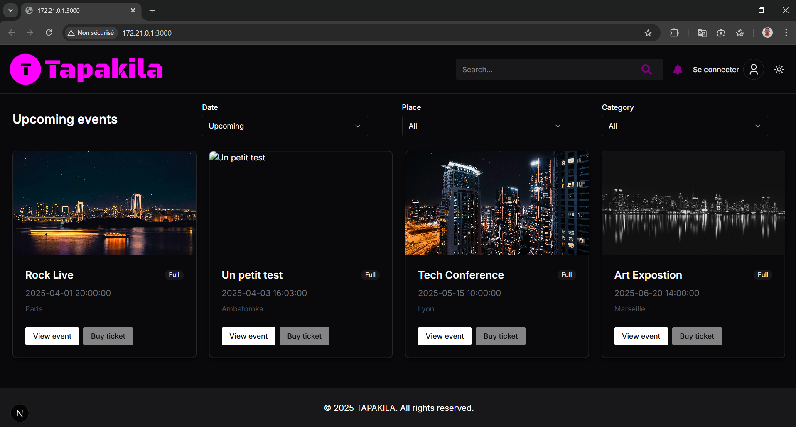
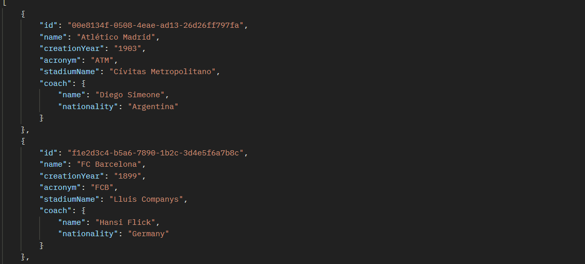
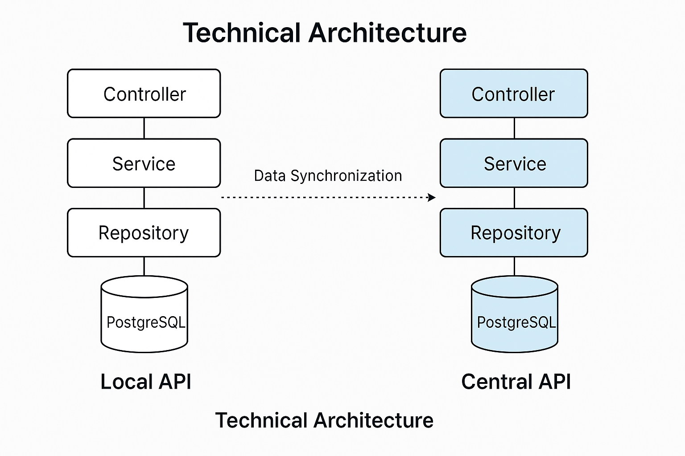

# Who I am?
 Hello, my name is Williest ANDRY NY AINA, I’m 20 years old and I’m a second‑year undergraduate student at the Haute École d’Informatique.
 I’m currently enrolled in the “Ecosystème Logiciel” university program, which focuses mainly on web development and cloud operations.

I seek a work-study placement in back-end development.

# Projects
- ## Event Manager Tapakila
### GitHub: [Tapakila](https://github.com/Williest-Andry/Tapakila.git)

### Description:

A full‑stack platform that lets users browse events, reserve tickets (VIP, Standard, Early Bird) and manage their bookings. It comprises a public site, an admin dashboard and an REST API with role‑based access control.

### Technologies:

Public Frontend: Next.js 15 (App Router), Incremental Static Regeneration (ISR), Server Actions

Admin Dashboard: React 18 + Vite, Zustand for state management

Backend API: Node.js, Express, JWT authentication, PostgreSQL

### Key Achievements & Impact:

Decoupled Architecture: Separate Next.js public site, React admin dashboard, and standalone API for improved flexibility and scalability.

Granular Role‑Based Access: Secure, modular permissions for Admins, Organizers, and Users.

Seamless UX: Real‑time search filters, event filtering

- ## Football league management

### GitHub: [Football league management](https://github.com/yourUsername/fifa-championship-tracker)

### Description:
A two-level REST API system built with Spring Boot to help FIFA collect, track, and analyze statistics from Europe’s top five football leagues (Premier League, La Liga, Bundesliga, Serie A, Ligue 1). The system is divided into:

A local API for each championship: registers data on players, clubs, matches, and stats. **It was fully developed by me.**

A central API for FIFA: synchronizes data from all championships and computes global statistics on teams, players, and leagues.

The project simulates real-world football logic, including club compositions, match results, point systems, season management, and data-driven rankings.

### Technologies:

Backend: Spring Boot 

Database: PostgreSQL

API Design: OpenAPI 3, YAML specification

Testing & DevOps: Postman, JUnit

Architecture: Layered (Controller, Service, Mapper, Repository) following SRP. 

### Key Features & Achievements:

Modular Architecture:

Championship APIs: handle players, clubs, matches, and season stats

Central API: fetches and aggregates data across leagues

Season Management:

Auto-match generation between clubs (home & away logic)

Match and Ranking Logic:

Point system (win/draw/loss), ranking computation

Advanced club stats: points, goals scored/conceded, goal difference, clean sheets

Player stats: goals and total play time

Filtering & Analytics:

GET /bestPlayers with filters (top, playingTimeUnit)

GET /championshipRankings: league comparison based on team stats

- ## Restaurant Management

### GitHub: [Restaurant Management](https://github.com/yourUsername/restaurant‑springboot)

### Description:
A fully modular Spring Boot backend for a restaurant management system. It exposes RESTful endpoints to manage ingredients (with dynamic price and stock filters), dishes (with ingredient composition), and orders (with status transitions). The project enforces a clean separation of concerns (Controllers, Services, Repositories, Mappers, Configurations), provides an OpenAPI 3 specification. Finally, it implements a two‑tier architecture with branch‑level and central APIs.

### Technologies:
Framework: Spring Boot 

Database : PostgreSQL 

API Spec & Testing: OpenAPI 3, Postman, JUnit 

Architecture: Layered design (Controller, Service, Repository, Mapper, Configuration)

### Key Achievements & Impact:

Robust REST Design: Implemented endpoints for CRUD operations on ingredients, dishes, and orders, with parameterized filtering and full error handling (400 Bad Request, 404 Not Found, 500 Server Error).

Layered Architecture: Enforced strict separation (Controllers handle HTTP, Services encapsulate business logic, Repositories access data, Mappers), improving maintainability and testability.

API Specification: Authored a comprehensive OpenAPI 3 spec covering all resources and sub‑resources and enabling clear consumer contracts.

# Skills
 
    

    Spring Boot

---

 

    Express.js

---

 
    
    Next.js

# Contact information
- Email : <williestnyainaandry@gmail.com>
- Phone : +261 32 87 774 77
- LinkedIn : <https://www.linkedin.com/in/williest-andry-ny-aina-2798a5337/>
- GitHub : <https://github.com/Williest-Andry>