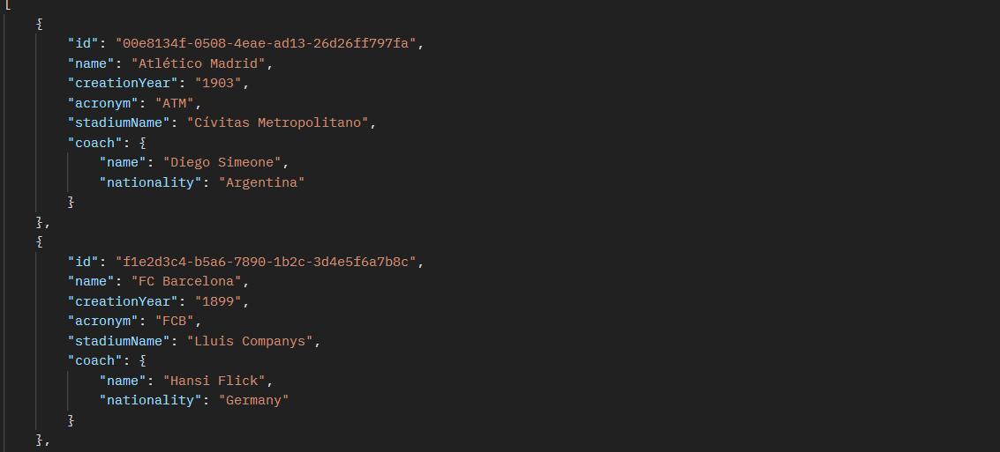
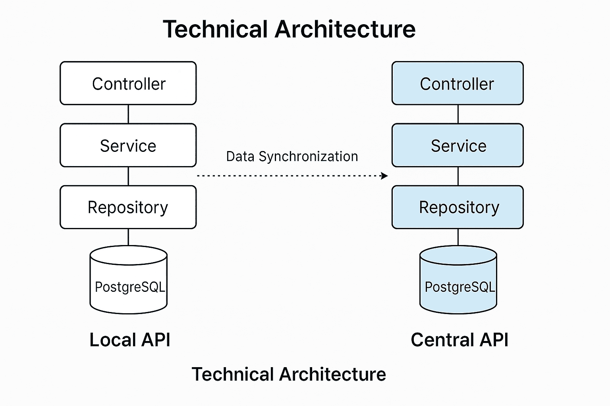

# Williest ANDRY NY AINA

Étudiant en 3ème année de licence en informatique à la Haute École d'Informatique,
spécialisation Écosystème Logiciel (développement web et cloud).

Je recherche un stage en développement fullstack. Je suis disponible immédiatement,
basé à Antananarivo.

Mon approche : concevoir des architectures simples et propres, écrire du code maintenable,
et livrer des interfaces utilisables. Je maîtrise aussi bien la construction d'une
API REST sécurisée que l'intégration côté frontend avec des outils modernes.

Actuellement, je finalise **Tapakila** - une plateforme de gestion d'événements
fullstack que j'ai refactorisée et étendue en solo, avec une API Node.js/Express/PostgreSQL
et un frontend Next.js 15 avec TypeScript.

📧 williestnyainaandry@gmail.com  
📞 +261 32 87 774 77  
🔗 [LinkedIn](https://www.linkedin.com/in/williest-andry)  
🐙 [GitHub](https://github.com/Williest-Andry)

---

# Projets

---

## 🎯 [Tapakila — Plateforme de gestion d'événements](https://tapakila-ui.vercel.app/)

**GitHub API :** [tapakila-api](https://github.com/Williest-Andry/tapakila-api) · **GitHub UI :** [tapakila-ui](https://github.com/Williest-Andry/tapakila-ui) ·
**Démo live :** [tapakila-ui](https://tapakila-ui.vercel.app/)

### Description

Plateforme fullstack de réservation de billets d'événements (VIP, Standard, Early Bird) avec gestion des rôles, authentification JWT et interface publique en Next.js 15.

**Contexte :** Projet académique de groupe (2025 - [ancien Tapakila](https://github.com/Williest-Andry/Tapakila.git)) que j'ai entièrement refactorisé et étendu en solo - nouvelle architecture, nouvelle stack, nouveau code.

**Mon rôle :** Refactorisation complète du backend (Node.js/Express/Prisma/PostgreSQL), conception de l'API REST avec contrat OpenAPI, intégration frontend TypeScript avec Next.js 15 et Chakra UI v3, mise en place de la couche d'état avec Zustand et TanStack Query.

### Technologies

| Couche    | Stack                                                                      |
| --------- | -------------------------------------------------------------------------- |
| Frontend  | Next.js 15 (App Router), TypeScript, Chakra UI v3, Zustand, TanStack Query |
| Backend   | Node.js, Express, Prisma, PostgreSQL, JWT, OpenAPI 3                       |
| Outillage | openapi-fetch, openapi-typescript, Zod                                     |

### Décisions techniques notables

- **Architecture découplée :** API REST indépendante consommée par un frontend Next.js — chaque couche déployable séparément.
- **Typage de bout en bout :** Types générés automatiquement depuis le contrat OpenAPI (`openapi-typescript`), zéro type manuel sur les appels API.
- **Authentification robuste :** Middleware JWT avec refresh token automatique côté client via intercepteur `openapi-fetch`.
- **Gestion d'état structurée :** Zustand pour l'auth et le panier de réservation, TanStack Query pour le cache serveur.

---

## ⚽ Gestion de ligues de football

**GitHub :** [football-championship-api](https://github.com/Williest-Andry/football-championship-api.git)

### Description

Système d'APIs REST en Spring Boot pour collecter et agréger les statistiques des 5 grands championnats européens (Premier League, La Liga, Bundesliga, Serie A, Ligue 1).

Architecture à deux niveaux : une API locale par championnat (joueurs, clubs, matchs, classements) et une API centrale FIFA qui synchronise et calcule les statistiques globales.

**La partie locale a été entièrement développée par moi.**

### Technologies

Backend : Spring Boot · Base de données : PostgreSQL · Spec API : OpenAPI 3
Architecture : Couches Controller / Service / Repository / Mapper

### Réalisations clés

- Génération automatique des matchs aller-retour entre clubs avec calcul des points (victoire/nul/défaite), classements et statistiques avancées (buts, clean sheets, temps de jeu).
- Endpoints analytiques avec filtres paramétrés : meilleurs joueurs, comparaison de championnats.
- Contrat OpenAPI 3 complet couvrant toutes les ressources et sous-ressources.

---

## 💰 MoneyWise — Application mobile de gestion financière personnelle

**Télécharger l'APK :** [Google Drive](https://drive.google.com/file/d/1GG8gQkYXyIyyoBsHDTXU6rX9dc7BlB4X/view?usp=drive_link)  
**Vidéo de démo :** [Voir la démonstration](https://drive.google.com/file/d/1tN60N91cRaIDys7yjPHTHvZVwI2aoBI_/view?usp=drive_link)  
**GitHub :** [public-money-wise](https://github.com/Williest-Andry/public-money-wise.git) _(copie publique - projet collaboratif)_

### Description

Application mobile React Native de gestion financière personnelle : suivi des dépenses quotidiennes/mensuelles/annuelles, objectifs financiers avec notifications, portefeuilles multi-devises, et une fonctionnalité premium de gestion de budget de projets avec génération de PDF.

Projet réalisé en groupe de 5 dans le cadre d'un examen académique - [code source privé](https://github.com/Tsantanny/money-wise).

### Technologies

React Native · Expo · Typescript · PostgreSQL · Google Auth · Biométrie (Fingerprint) · Notifications push · Génération PDF

### Mon rôle

- **Module Objectifs (Goals) — développé intégralement par moi :** ajout, modification, suppression et affichage paginé des objectifs de dépenses/revenus avec filtres par intervalle de dates ; notifications push à chaque échéance redirigeant vers l'objectif concerné.
- **Modification de portefeuille :** formulaire d'édition avec validation et mise à jour des statistiques associées.
- **Affichage des projets avec filtres :** écran de liste des projets budget avec filtrage paramétré et navigation vers la vue détaillée.

### Ce qui rend ce projet concret

- APK fonctionnel téléchargeable et installable directement
- Authentification biométrique (sans mot de passe après première connexion)
- Notifications push paramétrables par l'utilisateur
- Fonctionnalité premium avec génération et partage de PDF

---

## 🍽️ Gestion de restaurant

**GitHub :** [sale-point-restaurant](https://github.com/Williest-Andry/sale-point-restaurant.git)

### Description

Backend Spring Boot pour un système de gestion de restaurant : ingrédients (avec filtres prix/stock), plats (compositions), et commandes (transitions de statut). Architecture en deux niveaux avec API centrale et API par point de vente (**développée par moi.**).

### Technologies

Framework : Spring Boot · Base de données : PostgreSQL · Spec : OpenAPI 3
Architecture : Couches Controller / Service / Repository / Mapper / Configuration

### Réalisations clés

- CRUD complet sur ingrédients, plats et commandes avec filtrage paramétré et gestion d'erreurs structurée (400, 404, 500).
- Séparation stricte des responsabilités : la logique métier ne touche jamais la couche HTTP.
- Spécification OpenAPI 3 rédigée manuellement, utilisable comme contrat de consommation pour tout client tiers.

---

# Compétences

## Frontend

- **Next.js 15** (App Router, Server Components, middleware)
- **React Native** (Expo)
- **TypeScript**
- **TanStack Query v5** (fetching, cache, synchronisation serveur)
- **openapi-fetch / openapi-typescript** (client API typé depuis contrat OpenAPI)
- **Zustand** (gestion d'état global)
- **Zod** (validation de formulaires)
- **Chakra UI v3**
- **Nativewind + Tailwind CSS**

## Backend

- **Node.js / Express** (REST API, middlewares, architecture modulaire)
- **Spring Boot** (REST API, architecture en couches)
- **JWT** (authentification, access token + refresh token)
- **Prisma** (ORM, migrations)
- **PostgreSQL**

## Conception & Outillage

- **Git / GitHub** (versioning, branches, pull requests)
- **GitHub Actions** (CI/CD — pipelines d'intégration continue)
- **OpenAPI 3** (conception contract-first)
- **Postman** (tests et documentation d'API)
- **Docker** (conteneurisation, déploiement local)
- **JUnit** (tests unitaires Java)

## Notions maîtrisées

- Architecture découplée frontend / backend
- Typage de bout en bout depuis un contrat OpenAPI
- Authentification JWT avec refresh automatique
- Séparation des responsabilités (Controller / Service / Repository)
- App Router Next.js : Server vs Client Components, Suspense
- Pipeline CI/CD avec GitHub Actions
