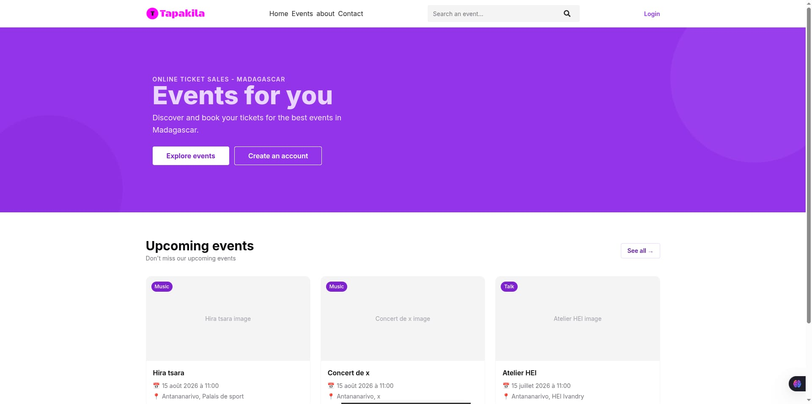

# Williest ANDRY NY AINA

Étudiant en 3ème année de licence en informatique à la Haute École d'Informatique,
spécialisation Écosystème Logiciel (développement web et cloud).

Je recherche un stage en développement fullstack. Je suis disponible immédiatement,
basé à Antananarivo.

Mon approche : concevoir des architectures simples et propres, écrire du code maintenable,
et livrer des interfaces utilisables. Je maîtrise aussi bien la construction d'une
API REST sécurisée que l'intégration côté frontend avec des outils modernes.

Actuellement, je finalise **Tapakila** - une plateforme de gestion d'événements
fullstack que j'ai refactorisée et étendue en solo, avec une API Node.js/Express/PostgreSQL
et un frontend Next.js 15 avec TypeScript.

📧 williestnyainaandry@gmail.com  
📞 +261 32 87 774 77  
🔗 [LinkedIn](https://www.linkedin.com/in/williest-andry-ny-aina-2798a5337/)  
🐙 [GitHub](https://github.com/Williest-Andry)

# Projets

---

## 🎯 [Tapakila — Plateforme de gestion d'événements](https://tapakila-ui.vercel.app/)

**GitHub API :** [tapakila-api](https://github.com/Williest-Andry/tapakila-api) · **GitHub UI :** [tapakila-ui](https://github.com/Williest-Andry/tapakila-ui)

### Description

Plateforme fullstack de réservation de billets d'événements (VIP, Standard, Early Bird) avec gestion des rôles, authentification JWT et interface publique en Next.js 15.

**Contexte :** Projet académique de groupe (2025 - [ancien Tapakila](https://github.com/Williest-Andry/Tapakila.git)) que j'ai entièrement refactorisé et étendu en solo - nouvelle architecture, nouvelle stack, nouveau code.

**Mon rôle :** Refactorisation complète du backend (Node.js/Express/Prisma/PostgreSQL), conception de l'API REST avec contrat OpenAPI, intégration frontend TypeScript avec Next.js 15 et Chakra UI v3, mise en place de la couche d'état avec Zustand et TanStack Query.

### Technologies

| Couche    | Stack                                                                      |
| --------- | -------------------------------------------------------------------------- |
| Frontend  | Next.js 15 (App Router), TypeScript, Chakra UI v3, Zustand, TanStack Query |
| Backend   | Node.js, Express, Prisma, PostgreSQL, JWT, OpenAPI 3                       |
| Outillage | openapi-fetch, openapi-typescript, Zod                                     |

### Décisions techniques notables

- **Architecture découplée :** API REST indépendante consommée par un frontend Next.js — chaque couche déployable séparément.
- **Typage de bout en bout :** Types générés automatiquement depuis le contrat OpenAPI (`openapi-typescript`), zéro type manuel sur les appels API.
- **Authentification robuste :** Middleware JWT avec refresh token automatique côté client via intercepteur `openapi-fetch`.
- **Gestion d'état structurée :** Zustand pour l'auth et le panier de réservation, TanStack Query pour le cache serveur.

---

# Skills

    Spring Boot

---

    Express.js

---

 
    
    Next.js
